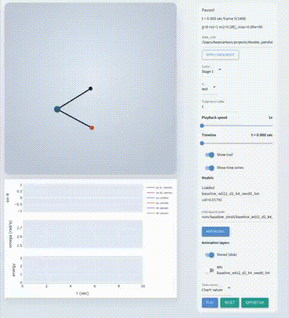

# Double Pendulum

Interactive Python simulation of a planar double pendulum. Dynamics use the Lagrangian equations of motion with fixed-step RK4. Two NiceGUI apps share the same SVG styling:

| Script | URL | Purpose |
| --- | --- | --- |
| `app.py` | http://localhost:8765 | Live sandbox: sliders change ICs and parameters, sim integrates forward |
| `app_data.py` | http://localhost:8766 | Browse `.npz` trajectory pools (stage / split / traj index) |

## Demo (surrogate model)

Trained MLP surrogate (`small_v1`, stage 1) rolled out next to the stored physics trajectory:

<!-- GitHub README: repo paths and <video> tags do not inline-play. Edit this file on github.com, drag assets/small_v1_stage1.mp4 into the editor, paste the user-images URL on the next line, then remove the GIF. -->


Full visualization guide (sources, CLIs, file formats): **[docs/visualization.md](docs/visualization.md)**.

## Setup

```bash
python3 -m venv .venv
source .venv/bin/activate
pip install -r requirements.txt
python app.py
```

Generate dataset pools before using `app_data.py`:

```bash
python -m srcs.simulation.generate_data --data-root data
```

## Tests

```bash
python -m pytest tests/
```

## Package layout

- `srcs/physics/` — RK4, energy, wrapping
- `srcs/simulation/` — sampler, `.npz` pools, `generate_data` CLI
- `srcs/model/` — MLP, loss, train tensors
- `srcs/train/` — `epoch.py`, run dirs, baseline search
- `srcs/visualization/` — SVG, plots, gifs, trajectory sources
- `app.py` / `app_data.py` — NiceGUI entrypoints
